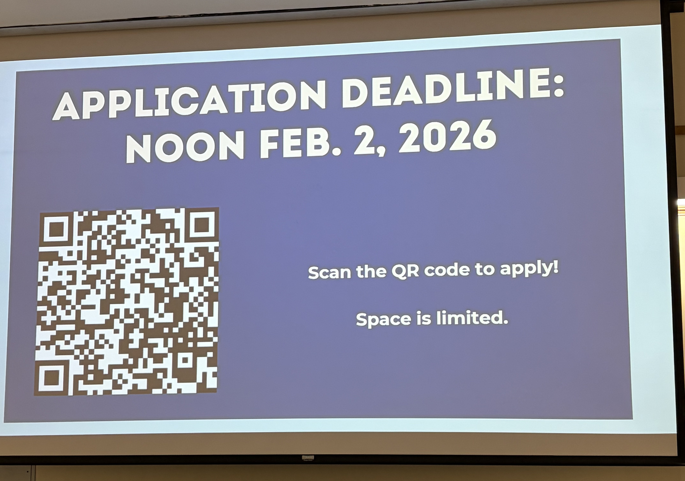

2026 01 15  
TECH TREK INFO SESSION  
(BYU CS)
---

---

# Agenda

- Mike Jones, Depart. Chair.
- Jerod Wilkerson, Faculty.
- Ryan Farrell, Faculy.
- Sarah Warcup, Ex Relations & Alumni Manager.
- Student Testimonials:
    - Dexter Syndergaard & Aaron Starkweather.
- Application Process & questions.

# Mike Jones: Non-obvious reasons to go on a Tech Trek

Pros ab tech treks that might not be obvious:

<!-- - See what it's like to be a disciple of Christ *and* a learner in CS. -->
- When you go on these Tech Treks, you get to interact w/ BYU alumni.
    - Hence you'll see disciples of Christ who are data scientists, software engineers, etc. So you'll see how to weld living as a disciple w/ being a CS professional.
- Dr. Jones believes CS is *the* major to set you up to have a significant leadership/impact on technology & society.
    - These Tech Treks inspire you to think big & bold ab who you can become.
        - Gave an e.g. of someone who did one of these Tech Treks @ BYU and is now high up in Microsoft working on AI.

# Jerod Wilkerson: Where we might be going

## How they decide where to go

They start by figuring out where alumni are. Once they find a place where they have a significant number of alumni willing to help & host, the profs/staff go out and visit them ("reconnaissance").

Then, when you do your application, you rank where you'd like to go. They take this into account when deciding on the final place to go.

## Possible Locations

They're not sure yet where the 2026 Tech Treks will be, but they've determined these locations have a high number of BYU alumni:

- SLC & Silicon Slopes
- Seattle/Portland
- Bay Area
- LA
- Phoenix
- Denver
- Dallas/Ft Worth
- Austin
- Washington DC

(They're planning on doing **three** of these Tech Treks this year.)

(They're thinking if they do Dallas/Ft Worth or Austin they'd combine them into one.)

# Ryan Farrell: Companies visited in 2025

- Tesla
- Adobe
- Amazon
- Crumbl
- Meta
- Microsoft
- Google
- Lawrence Livermore National Laboratory
- Palantir
- Axon
- Apple
- Moloco
- 2025 Utah AI Summit

<!-- One of the important things ab the Tech Treks is visiting the alumni there.  -->

Tech Treks have been done in both the Fall & the Spring. They're going to try to do **two** Tech Treks this Spring. This way, you can connect w/ BYU alumni and then stay connected throughout the semester. (BYU alumni, he said, are eager to help BYU's students. So giving you the opportunity to meet them is very valuable.)

The Tech Trek also helps you get to know the CS profs & faculty as well.

As you consider your future, there's a lot of opportunities for you. Your HF cares ab you. Maybe it's not one specific spot He wants you to land in, but regardless He'll guide you.

# Sarah Warcup

## Local Tech Trek

### Example of a local Tech Trek agenda

- Single day.
- Meet @ ~7:30 AM.
- Visit 2-3 companies during lunch.
- Return to campus ~5:30 PM.

^ This is an e.g. agenda if they visited somewhere really close, like Salt Lake City.

### Details for local Tech Treks

- No cost.
- 100% commitment once notified of acceptance.
- No special requests.
    - You cannot leave, meet them there, etc. You are commited to come with the group, stay with the group, and come back with the group.

## Out-of-state Tech Trek

### Example

3-4 day commitment

- Day 1: Travel to destination, 1 company visit, alumni dinner.
- Day 2: Visit 2-3 companies, sightseeing in evening.
- Day 3: Visit 2-3 companies, travel back to Utah.

### Details

- $300 NON-REFUNDABLE fee.
- 100% commitment once notified of acceptance.
- Mandatory Trek Meeting.
- No special requests.
    <!-- - The *only* thing even kind of sort of allowed is during the sight-seeing evening your family can meet you w/ the group. -->

### More cost details

Includes:

- airfare
- hotel
- transportation (*except* to/from SLC airport)

Students are responsible for:

- transportation to/from SLC airport
- meals
- additional entertainment

$300 Fee

- Non-refundable
- If you're selected for the Tech Trek: $300 chartged to student account.
- If you're selected for the Tech Trek: provide copy of Photo ID.

# Student Experiences: Dexter Syndergaard

Dexter LOVED his Tech Trek.

- Gave him the opportunity to meet other students and alumni.
- Highly recommends you to get to know Sarah Warcup herself.
- Other helpful helpful connections:
    - Chris Alder @ Google: Helped him format his resume and stuff or smth idrk.s
    - Kit Packing: Helped him understand that these big tech companies are not unreachable.
- The Tech Trek gave him invaluable skills.
    - In today's day and age, it's not so easy to just submit your resume and get an offer. :(
- Knowing people allows you to get your foot in the door.
- Convinced some of the students he met are going to become highly influential in the future, so getting those connections early on is huge.

Someone asked how juggling classes went. He said it wasn't too bad for him: He was able to get most assignment deadlines pushed back, and with 

Someone asked what the most impactful stuff he learned was. Dexter said the interview stuff was dope:

- They did mock interviews w/ someone from Google.
- Realized they're not expecting you to know *everything*. They know you're just college students&mdash;but they still find you valuable.

Go prepared: 

- Dexter recommended you research some stuff ab the companies you're visiting so you can come w/ questions to ask them. 
- Ask for tips for success. **Find someone who's where you want to be, and see how they got there.**

Someone asked how do you keep connections after you meet them: 

- After the Trek, you get a list of emails & LinkedIn profiles of all the alumni you talked to.
    - Dexter recommends contact through email, b/c most people who already have jobs don't check LinkedIn.

# Student Experiences: Aaron Starkweather

- Alumni all supes want to help. There's a special connection there. They can last beyond the Tech Trek.
- Network is the key to success (in any field). Make sure you're building relationships w/ the other students, profs, and alumni who are there.
    - It'll help you progress your career, and then eventually careers of others.
- With that said, make sure you're capable of being successful in mock interviews. 
- **Invest in your career and your personal development, and the rest will work out.**

# 2026 Application Deets

> DEADLINE: FEB. 2 @ NOON

What you'll have to fill out:

- Contact info
- School info: Year in school, major, minor, emphasis, GPA.
- Questions:
    - Why do you want to go on Tech Trek?
    - Experience (not required)
    - Future benefits you anticiapte.
- Uploads:
    - Resume upload
    - 30s Video introduction upload
        - Share a little bit about who you are and something unique ab yourself that makes you memorable.
        - (Consider this special practice for an interview.) 
    - ** SAVE RESUME & VIDEO AS `FirstnameLastnameResume` and `FirstnameLastnameVideo`. 
    - (Sarah said to have your video & resume prepared *before* you start the application.)
- Applied before/attended before/rank city preferences  

**Space is limited! Apply now!!!** (Dw tho, they do not give higher priority to earlier applicants.)

The QR code to apply will be put out on Social Media, their website, and on posters in the Talmage.

<!-- Uhhhh I asked her if they give priority to people who apply earlier...and she made a joke but didn't rly answer my question so idrk. -->

## Tips, tricks, and questions

Submitting an application is **non-committal**. Once applicants are selected, they're emailed and they'll say "yuh" or "nah"&mdash;"yuh" is the point of commitment (for stuff like the $300 non-refundable fee and stuff).

Typically they have ~80-90 applicants and they're only allowed to take ~15-18. (On one trip they were able to take ~40 tho so who knows.)

What they're looking for when selecting applicants:

- Who is this going to mean a lot to?
- Skills & preferences you have that would be a good fit for the companies they're thinking of visiting.

One reccommendation: Don't just say you want to network (that's what everyone is going to say). 

Sarah estimates applicants will hear back by&mdash;at the latest&mdash;the end of Feb.

# What if you don't get chosen for the Tech Trek??? :(

You still have ways to network. Remember that **BYU Connect** exists to connect students w/ alumni.

