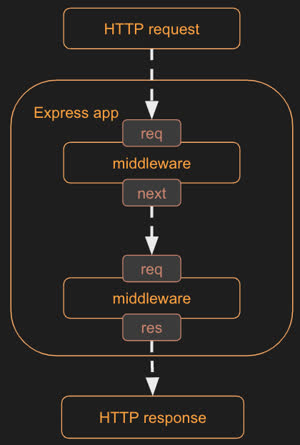

# Express

The simple [Node web service](./TODO:-link-here) we made is great for simple stuff, but to build a production-ready web app, you'd need a framework w/ a bit more functionality for easily implementing the full web service. 

Fortunately, Node has an `Express` package that provides support for:

1. Routing endpoint requests.
2. Manipulating HTTP requests w/ JSON body content.
3. Generating HTTP responses.
4. Using `middleware` to add functionality. (Huh?)

(Express was created by TJ Holowaychuk (who looks like the lead singer of an emo band) and is (currently) maintained by the [Open.js foundation](https://openjsf.org/).)

## Setup

In your project directory:

    $ npm install express

Then, in a JS file, you'd start a server on port 8080 like this:

```js
const express = require('express');
const app = express();

app.listen(8080);
```

You then add HTTP routing and middelware functions to the `app` object.

> [!NOTE]
> For the remainder of this document, the object returned by `require('express')` will be referred to as just "`express`", and the object returned by `express()` will be referred to as "the `app` object", or simply "`app`". 

## Defining routes

<!-- HTTP endpoints are implemented in Express by defining routes that call a function based upon an HTTP path. -->

<pre><code>app.<u>method</u>(<u>path</u>, (req, res, next) => {
    <em>// do stuff w/ req/res/next</em>
});</code></pre>

To set up HTTP endpoints on an Express `app`:

- You call `app` object **methods named after HTTP request method**,
- ^ into which you **pass in the endpoint's URL** as well as a **function that takes three parameters**: `req`, `res`, and (optionally) `next`.
  - **`req`: HTTP request object**.
  - **`res`: HTTP response object**.
  - **`next`: Optional**. Used if you want to use middleware functions (see below)&mdash;i.e., chaining functions together when handling a single request.
      - **Routing function patterns are compared in the order they are added to the `app` Express object**. So if you have two routing funcs w/ matching patterns, the first one that was added will be called and given the next matching function in the `next` parameter.
      - **You do not need to include the parameter `next`** for endpoints that don't call it.

### Path parameters & advanced path matching

You can get fancy w/ the path you pass into the `app` routing function thing:

- To have path parameters, **prefix the param name w/ `:`**.
  - These are then **accessible via `req.params`**.
- **`*` will match to any sequence** of characters. ("Wildcard")
- You can even have **regex expressions**. 
  - (It looks like you put regex expressions betwen `/.../` instead of `"..."`.)

### Example

e.g, to set up a GET request on the path `/store/`, with a parameter `storeName`:

```js
app.get('/store/:storeName', (req, res, next) => {
    res.send({ name: req.params.storeName });
});
```

## Middleware (`next()`)

In the (standard) mediator/middleware design pattern, there is a a mediator that loads the middleware components and determines their order of execution. I.e., **a request is made to the mediator, which passes the request between the middleware components.**

All routing functions are also middleware functions. However, routing functions are only called if its pattern matches to the request's path, while **middleware functions are always called for every HTTP request**&mdash;unless a preceding middleware function doesn't call `next()`. (What???)



- Middleware functions are added to `app` via <code>app.use(<em>middlewareFunc</em>);</code>.
  - *`middlewareFunc`* must take three parameters (`req`, `res`, and `next`&mdash;just like routing functions).
- The order you add middleware funcs to `app` is the order they're called in.
- Middleware funcs must end with a call to `next()`, which invokes the next middleware func.
  - If a middleware func does not call `next()`, the middleware chain stops.
- Middleware funcs commonly add fields & functions to the `req` and `res` objects (which can be used in later middleware funcs).

### Making your own middleware

- To make your own middleware function, just make a function that takes three parameters (`req`, `res`, and `next`), and then pass that function into `app.use()`.
  - Make sure to call `next()` at the end of your middlware func!!
  - You can do this concisely by just passing in an arrow func into `app.use()`.

### Builtin middleware

There exist middleware functions built in to Express. 

e.g., <code>express.static(<em>URL</em>)</code> is great for serving up a static file (located at *`URL`*) to the browser.

### Third party middleware

You can use 3rd party middleware funcs by using NPM to install its package and then including said package in your JS w/ `require()`.

e.g., using `cookie-parser` to simplify the generation & access of cookies:

    $ npm install cookie-parser

```js
const cookieParser = require('cookie-parser');

app.use(cookieParser());

app.post('/cookie/:name/:value', (req, res) => {
  res.cookie(req.params.name, req.params.value);
  res.send({ cookie: `${req.params.name}:${req.params.value}` });
});

app.get('/cookie', (req, res) => {
  res.send({ cookie: req.cookies });
});
```

## Debugging an Express web service

You can use VS Code to debug a web service written in JS that uses Express. (`F5` is the shortcut to start the debugger in VS Code.)

This allows you to add breakpoints to your code. (You can even add breakpoints in the code of your installed packages&mdash;remember that package source code is installed into the `node_modules/` directory.)

## Example: Putting ts all together

```js
const express = require('express');
const cookieParser = require('cookie-parser');
const app = express();

// Third party middleware - Cookies
app.use(cookieParser());

app.post('/cookie/:name/:value', (req, res) => {
  res.cookie(req.params.name, req.params.value);
  res.send({ cookie: `${req.params.name}:${req.params.value}` });
});

app.get('/cookie', (req, res) => {
  res.send({ cookie: req.cookies });
});

// Creating your own middleware - logging
app.use((req, res, next) => {
  console.log(req.originalUrl);
  next();
});

// Built in middleware - Static file hosting
app.use(express.static('public'));

// Routing middleware

// Get store endpoint
app.get('/store/:storeName', (req, res) => {
  res.send({ name: req.params.storeName });
});

// Update store endpoint
app.put('/st*suffix/:storeName', (req, res) => res.send({ update: req.params.storeName, prefix: req.params.suffix }));

// Delete store endpoint
app.delete(/\/store\/(.+)/, (req, res) => res.send({ delete: req.params[0] }));

// Error middleware
app.get('/error', (req, res, next) => {
  throw new Error('Trouble in river city');
});

app.use(function (err, req, res, next) {
  res.status(500).send({ type: err.name, message: err.message });
});

// Listening to a network port
const port = 8080;
app.listen(port, function () {
  console.log(`Listening on port ${port}`);
});
```