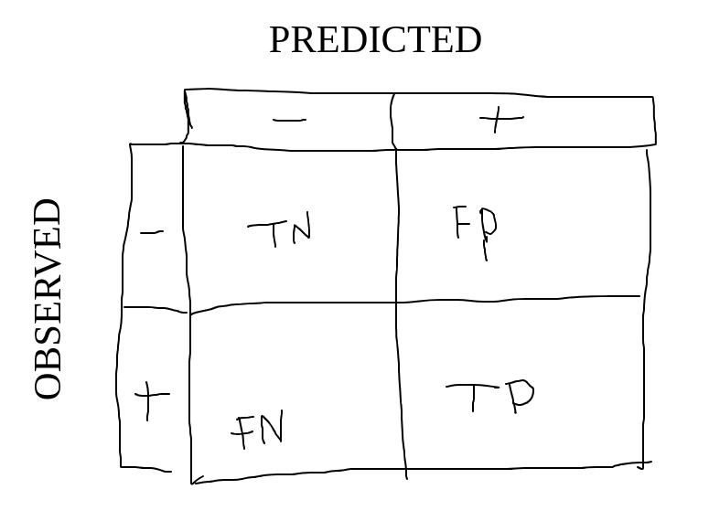

TODO: Go back through 3.3 more thoroughly.

# 3.1: Loss functions for classification

## Loss functions

> A **loss function** quantifies the DIFFERENCE btwn a model's PREDICTIONS and the OBSERVED VALUES (i.e. actual values).

- Lower values indicate better performance (for predictions).
- During model fitting, loss functions are used when choosing weights and params: the goal is to find weights/params that minimize the loss function you're using.
  - e.g. a log reg model is fitted by selecting the weights that minimize the log loss.
- LOW LOSS: GOOD PREDICTIONS.
- HIGH LOSS: BAD PREDICTIONS.

### Loss for classification

- For classification models, two things are accounted for in loss:
  - Did the model predict the right class?
  - Was the model certain (for its correct predictions)?
    - (Anything w/ a prediction probability lower than 1.00 is uncertain.)
- (Even correct classifications can come with a penalty for uncertain predictions. i.e., the model might predict the right class, but with a low prediction probability (certainty).)

## Absolute Loss

> **ABSOLUTE loss** of an instance quantifies the LOSS DUE TO UNCERTAINTY.  
> It considers the DIFFERENCE btwn the PREDICTED PROBABILITY and the OBSERVED (binary) CLASS.

$$L_{abs}(y_i, \hat p_i) = |y_i - \hat p_i|$$

- $y_i$ is the observed class, encoded as `0` or `1`.
- $\hat p_i$ is the predicted probability for the $i^{\text{th}}$ instance.
- The OVERALL abs loss function is given by the AVERAGE ABS LOSS OF ALL INSTANCES.
- "The loss is greater when the predicted probability is further from the observed class."
  - (Because the class is either `0` or `1`, and probs are btwn `0` and `1` as well...ig?)
- Abs loss does NOT consider the predicted class: Whether/not an instance's class was predicted correctly does NOT affect abs loss, bc abs loss only considers the diff btwn PREDICTED PROBABILITY and the observed class. 

## Log loss & likelihood functions

### Likelihood functions

> A **likelihood function** "measures the prob of observed data given a specified statistical distribution and params." (TODO: HUH???)

- For likelihood funcs: The higher the value of the func, the better the model fits&mdash;or would result in&mdash;the observed data.

### Log loss

For log reg models, we oft measure loss w/ a log-likelihood func for "mathematical convenience".

> The **log loss** of an instance is the NEGATIVE LOG-LIKELIHOOD (which comes out as non-negative).

$$L_{log}(y_i, \hat p_i) = -\bigg(y_i\ln(\hat p_i) + (1-y_i) \ln(1-\hat p_i)\bigg)$$

- Why neg log-likelihood? Well-fitting models would have a high log-likelihood and a small negative log-likelihood. So we just use the negative version.
- (Again, the OVERALL log loss is given by the AVERAGE LOG LOSS of all instances.)
- HIGHER PREDICTED PROB &rArr; LOWER LOG LOSS.

## Cross-entropy loss

Log loss is great if we're classifying a binary class. (Bc then our output feature can be encoded as `0` or `1`, so the math works out nicely.)

But what if the output feature has two or more classes?!? Enter entropy. 

> **Entropy** is a measure of UNCERTAINTY in a PROB DISTRIBUTION.  
> **Cross-entropy** is a measure of the DIFFERENCE btwn the OBSERVED prob dist and the PREDICTED prob dist of classes.

Consider an output feature $j=1,2,\dots,c$ classes. Let $\mathbf y = [y_{i1}, y_{i2}, \dots, y_{ij}]$, where $y_{ij} = 1$ if instance $i$ belongs to class $j$ (and $0$ if not). Then the cross-entropy loss of an instance $i$ is given by:

$$L_{entropy}(\mathbf y_i, \mathbf {\hat p}_i) = -\mathbf y_i \cdot \ln(\mathbf{\hat p_i}) = \sum_{j=1}^c y_{ij} \ln (\hat p_{ij})$$

- $\mathbf{\hat p_i}$ is instance $i$'s vector of predicted class probabilities.
- Each $y_{ij}$ is an observed distribution, whose predicted distrubtion is $\hat p_{ij}$.

(If the output feature vector is only a length of 2 (meaning there are only two classes), then cross-entropy loss is equivalent to log loss.)

## Hinge loss

> **Hinge loss** uses the DISTANCE an instance is from a DECISION BOUNDARY to measure loss.

Some classif models classify instances relative to a decision boundary. (Whatever tf that means?) Instead of a predicted prob, these models (typically) ret the signed distance that an instance lies from the decision boundary. Hence the outcome feature is either `-1` or `1`, NOT either `0` or `1`.

**Hinge loss** is given by:

$$L_{hinge}(y_i, d_i) = \text{max}(0,1-y_i d_i)$$

- $y_i$ is the observed class for instance $i$, encoded as either `-1` or `1`.
- $d_i$ is the signed distance $i$ is from the decision boundary.

Interpreting hinge loss looks a bit different:

- Correctly classified instances: $0 \le L_{hinge} \le 1$
  - LOWER value for hinge loss &rArr; HIGHER distance from the decision boundary.
- Incorrectly classified instances: $L_{hinge} \gt 1$

(Again, the overall hinge loss is the average hing loss of all instances.)

## Loss functions in scikit-learn

- Loss functions come from the `sklearn.metrics` module.

<br>

- Log loss & cross-entropy loss are implemented via `log_loss()`:
  - Params:
    - Array of observed classes (`y_true`)
    - Array of predicted probs (`y_pred`)
  - Implements cross-entropy loss when `y_true` consists of more than two classe.
  - [documentation](https://scikit-learn.org/stable/modules/generated/sklearn.metrics.log_loss.html)

<br>

- Hinge loss is implemented via `hinge_loss()`
  - Params:
    - Array of observed classes (`y_true`)
      - Elements must consist of one of two integers, where the integer for the positive class is greater than the integer for the negative class.
    - Array of predicted decisions (`pred_discision`)
  - [documentation](https://scikit-learn.org/stable/modules/generated/sklearn.metrics.hinge_loss.html)

# 3.2: Classification metrics

## Model evaluation & Classification metrics

> **Model evaluation** is the process of USING METRICS to assess how well a supervised ML model's PREDICTIONS MATCH OBSERVED VALUES.

> A **classification metric** quantifies the PREDICTIVE PERFORMANCE of a classifier (model?) by COMPARING the model's PREDICTED CLASSES to the OBSERVED CLASSES.

- Classification metrics are used to evaluated and compare fitted classification models.
- LARGE VALUES for classification metrics &rArr; BETTER PREDICTIONS.


COMMON CLASSIFICATION METRICS:

- Accuracy
- Precision
- Recall
- Confusion Matrices
- Kappa

(^ The next sections go over these.)

## Confusion Matrix

In binary classifications, we can consider outcomes to be POSITIVE (me likey) or NEGATIVE (me no likey). Furthermore, a classifer's prediction can either be correct (TRUE) or incorrect (FALSE). A confusion matrix compares predicted classifications against observed classifications in a table (seen below in my bad drawing).



More specifically, each cell is the *number* of true negatives (TN), num of true positives (TP), num of false negatives (FN), and num of false positives (FP).

$$\begin{bmatrix}
TN & FP \\
FN & TP \\
\end{bmatrix}$$

## Accuracy, Precision, Recall

- Accuracy, precision, and recall are all NON-NEGATIVE values ranging from `0` to `1`.
- ^ HIGHER VALUE &rArr; BETTER PERFORMANCE.

### Accuracy

> **Accuracy** is the proportion of CORRECT PREDICTIONS.  
> i.e., ***"How many did you get right?"***

$$\text{Accuracy} = \frac{\text{\# corect predictions}}{\text{\# total predictions}} = \frac{TP+TN}{TP+TN+FP+FN}$$

Accuracy is a simple measure of overall performance, but accuracy can be misleading when the # of observed instances in each class is imbalanced, so we oft combine it with precision and recall.

### Precision

> **Precision** is the proportion of CORRECT *POSITIVE* PREDICTIONS.  
> i.e., ***"How many of your positives did you get right?"***

$$\text{Precision} = \frac{\text{\# corect positive predictions}}{\text{\# positive predictions}} = \frac{TP}{TP+FP}$$

### Recall

> **Recall** is the proportion of CORRECTLY PREDICTED POSITIVE *INSTANCES*.  
> i.e., ***"How many positives did you catch?"***

$$\text{Recall} = \frac{\text{\# corect positive predictions}}{\text{\# positive instances}} = \frac{TP}{TP+FN}$$

(Because if it's a *false* negative, then it was a positive instance.)

### Precision vs. recall

> Precision measures the accuracy of the positive predictions, and recall measures the classifier's ability to predict all positive instances.

## Confusion Matrices & Accuracy/Precision/Recall

Here's a visualization of the formulas for accuracy (ACC), precision (PREC), and recall (REC). The denominators are circled, and the numerators are underlined.


## $F_1$-score and $F_\beta$-score

$F_1$ and $F_\beta$ are metrics that combine precision and recall into one measure.

### F1

> $F_1$-score is the HARMONIC MEAN of precision & recall.

$$F_1 = \frac{2 \times \text{Precision} \times \text{Recall}}{\text{Precision} + \text{Recall}}$$

- Harmonic mean is the reciprocal of the arithmetic mean of the reciprocals. 
  - So, for two numbers $A$ and $B$, their harmonic mean is $(\frac{A^{-1}+B^{-1}}{2})^{-1}$

### F-Beta

> $F_\beta$-score is the WEIGHTED harmonic mean of precision & recall, where $\beta$ adjusts the tradeoff of importance btwn precision & recall.

$$F_\beta = (1+\beta^2)\frac{\text{Precision} \times \text{Recall}}{(\beta^2 \times \text{Precision}) + \text{Recall}}$$

- $\beta < 1$ &rArr; PRECISION has more importance.
- $\beta = 1$ &rArr; $F_\beta = F_1$
- $\beta > 1$ &rArr; RECALL has more importance.

## Kappa ($\kappa$)

> $\kappa$ COMPARES the classifier model's accuracy ("OBSERVED" ACC) with the expected accuracy of a RANDOM CHANCE CLASSIFIER ("EXPECTED" ACC) based on that model.

Kappa is an alternative to accuracy.

$$\kappa = \frac{\text{Acc}_{obs}-\text{Acc}_{exp}}{1-\text{Acc}_{exp}}$$

- $\text{Acc}_{obs}$ is the (observed) accuracy of the classifier model you're measuring.
- $\text{Acc}_{exp}$ is the expected accuracy of a random classifier model.
- Interpreting $\kappa$:
  - $\kappa = 1$ (max) &rArr; model is a perfect classifier.
  - $\kappa = 0$ &rArr; model has same accuracy as a random chance classifier.
  - $\kappa < 0$ &rArr; classifier's accuracy is less than random chance's accuracy.

The expected accuracy of the model classifier is calculated as thus:

$$\text{Acc}_{exp}=\frac{\text{expected \# of correct predictions}}{\text{\# of total predictions}}$$

A random chance classifier based on a model will have the same # of total class predictions as the model, but assigns the predictions at random to instances. Its accuracy is just calculated like this:

$$\text{Acc}_{exp}=\frac{\text{expected \# of correct predictions from random classification}}{\text{\# of total predictions}}$$

For a binary random chance classifier, the expected # of correct predictions from the random classifier is the sum of the expected num of true pos & true negs:

$$\text{expected \# of correct predictions from random classification} = \frac{(FN + TP)(FP + TP) + (TN + FP)(TN + FN)}{TP + TN + FP + FN}$$

## Nonbinary classification metrics

| Metric         | Description |  
| -------------- | ----------- |  
| Confusion mtrx | Table w/ $c$ rows and $c$ cols. Counts for correct predictions are on the diagonal cells & misclassification counts are on the off-diagonal cells. |  
| Accuracy       | Proportion of correct classificationos for all $c$ classes. |  
| Kappa          | A measure of the observed (actual) accuracy relative to the expected (calculated) accuracy of a random chance classifier w/ the same # of predictions in each of the $c$ classes. (The expected # of correct predictions is the sum of the expected # of correct predictions for each of the $c$ classes.) |  

## Classification metrics in scikit-learn

These are all found in the `sklearn.metrics` module.

| Metric        | Function                           |  
| ------------- | ---------------------------------- |  
| Confusion mtx | `confusion_matrix(y_true, y_pred)` |  
| Accuracy      | `accuracy_score(y_true, y_pred)`   |  
| Precision     | `precision_score(y_true, y_pred)`  |  
| Recall        | `recall_score(y_true, y_pred)`     |  
| Kappa         | `cohen_kappa_score(y1, y2)`        |  

## Code Example

### Confusion mtx of Gaussian Naive Bayes model

```py
# Import packages and functions
import numpy as np
import pandas as pd
from sklearn import metrics
from sklearn.preprocessing import StandardScaler
from sklearn.naive_bayes import GaussianNB

# Load the hawks dataset
hawks = pd.read_csv("hawks.csv")

# Define input and output features
X = hawks[["Hallux", "Culmen"]]
y = hawks[["Species"]]

# Scale the input features
scaler = StandardScaler()
X = scaler.fit_transform(X)

# Initialize and fit a Gaussian Naive Bayes model
NBModel = GaussianNB()
NBModel.fit(X, np.ravel(y))

# Calculate the predictions for each instance in X
predNB = NBModel.predict(X)

# Calculate the confusion matrix 
confMatrix = metrics.confusion_matrix(np.ravel(y), predNB)

# Print the confusion matrix of the Gaussian Naive Bayes model
print("GaussianNB model\n", confMatrix)
```

### Accuracy & Kappa of Gaussian Naive Bayes model

```py
# Import packages and functions
import numpy as np
import pandas as pd
from sklearn import metrics
from sklearn.preprocessing import StandardScaler
from sklearn.naive_bayes import GaussianNB

# Load the hawks dataset
hawks = pd.read_csv("hawks.csv")

# Define input and output features
X = hawks[["Tail", "Weight"]]
y = hawks[["Species"]]

# Scale the input features
scaler = StandardScaler()
X = scaler.fit_transform(X)

# Initialize and fit a Gaussian Naive Bayes model
NBModel = GaussianNB()
NBModel.fit(X, np.ravel(y))

# Calculate the predictions for each instance in X
hawkPred = NBModel.predict(X)

# Calculate the accuracy
accuracy = metrics.accuracy_score(np.ravel(y), hawkPred)

# Calculate kappa
kappa = metrics.cohen_kappa_score(np.ravel(y), hawkPred)

# Print accuracy and kappa of the Gaussian Naive Bayes model
print("GaussianNB model accuracy:", round(accuracy, 3))
print("GaussianNB model kappa:", round(kappa, 3))
```

### Precision & Recall of Gaussian Naive Bayes model

```py
# Import packages and functions
import numpy as np
import pandas as pd
from sklearn import metrics
from sklearn.preprocessing import StandardScaler
from sklearn.naive_bayes import GaussianNB

# Load the field goal dataset
fieldGoal = pd.read_csv("fg_attempt.csv")

# Define input and output features
X = fieldGoal[["Distance", "ScoreDiffPreKick"]]
y = fieldGoal[["Outcome"]]

# Scale the input features
scaler = StandardScaler()
X = scaler.fit_transform(X)

# Initialize and fit a Gaussian Naive Bayes model
NBModel = GaussianNB()
NBModel.fit(X, np.ravel(y))

# Calculate the predictions for each instance in X
predNB = NBModel.predict(X)

# Calculate the precision
precision = metrics.precision_score(np.ravel(y), predNB)

# Calculate the recall
recall = metrics.recall_score(np.ravel(y), predNB)

# Print precision and recall of the Gaussian Naive Bayes model
print("GaussianNB model precision:", round(precision, 3))
print("GaussianNB model recall:", round(recall, 3))
```

# 3.3: Evaluating models w/ plots

## Plot types

### Plots for classification & regression models

- Plots for classification models:
  - **Decision boundary plot**
    - This is the one that cuts up the graph into boundaries.
  - **ROC curve plot**
    - This one looks like a staircase.
- Plots for regression models:
  - **Prediction error plot**
  - **Partial dependence plot**


### Prediction error plot (i.e. risidual plot)

* $y_i - \hat y_i$
* Funnel shape.

### Partial dependence plot

$$\bar {\hat y}_{x_j=a}=\frac 1 n \sum^n_{i=1} \hat y_{i ,x_j = a}$$

## Plotting in Python

### Plotting classification models

TODO: do this.

### Plotting regression models

TODO: do this

# 3.4 & 3.5

lol I sped through these to get to the labs.

TODO: come back to these.

# 3.6: LAB

