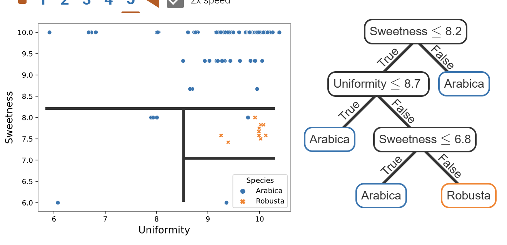

# 6.1: Decision trees for classification

## Trees

A tree is a hierarchical structure of nodes & edges with **no loops**.

- A root node is a node with no parent.
- A leaf is a node w/ no children.
- The **depth** of a node is the (minimum) **number of edges it takes to reach that node from the tree's root**.

## Decision Trees

- A ***decision tree*** is a tree where each node has **a QUESTION that determines WHICH CHILD to descend to**.
- In decision trees, each LEAF represents a FINAL DECISION.

## Decision Tree Classifiers (DTC)

Decision tree classifiers are decision trees built for classification.

- **Each LEAF is a CLASS** from the OUTPUT feature.
- At each **NODE**, the decision is based on EITHER:
  - a) an **INEQUALITY of NUMERICAL features**.
    - e.g. acidity &le; 5.5
  - b) an **EQUALITY for CATEGORICAL features**.
    - e.g. roast == 'dark'

When training a DTC model, we keep track of the number of instances of each class that lie at each leaf. (And maybe at each decision, too?) This data is used for calculating the confidence of predictions.

### Graphically representing decision trees

6.1.3: 



- Each DECISION RULE divides the feature space w/ HYERPLANES that are PERPENDICULAR to the DECISION FEATURE'S AXIS.
  - Each REGION resulting from these divisions MATCHES A LEAF.
- The PREDICTED CLASS for each leaf is the MOST COMMON CLASS IN THE MATCHING REGION

<!-- ### Deciding on decisions

How do you determine what to put for each node's decision?

I am fully talking out my ahh here but here's what I'm picking up:

- Each decision should do the best it can to separate classes.
  - e.g., if you're trying to determine whether your Valentine's Day gift is good, adding a decision splitting btwn `Dark Chocolate` and `Flowers` would be pretty useless, since both are beloved by women.
- The specificity of each decision should increase as you get further from the root.
  - I.e., earlier nodes should split the dataset into big chunks (ideally close to half-and-half, I'd assume).
  - This ensures you have to perform fewer checks, meaning you'll reach a leaf faster.
    - I.e., it ensures your decision tree is more balanced.


### Complexity vs. Accuracy

- A leaf that captures INSTANCES of ALL THE SAME CLASS is called a **pure leaf**.
- A 100% ACCURATE decision tree would have ONLY PURE LEAVES...but it would also be VERY COMPLEX, increasing computation time and stuff. 
  - So ig there's like a balance between how accurate your dec tree is and how complex it is. -->

## Decision Tree Classifiers in sklearn

Sklearn implements DTCs w/ **`DecisionTreeClassifier()` from `sklearn.tree`**.

The syntax is basically the same as all models we've used thus far:

- `.fit(X, y)` and `.predict(X)` train the model and make predictions, respectively.
- `.predict_proba(X)` predicts class probabilities (i.e. the probability that a classification is correct).
  - For DTCs, this is the proportion of training samples of that class in the leaf node.
- Class labels can be accessed with the `.classes_` attribute.

## Measures of fit (i.e. evaluating a DTC...I think?)

A DTC's measures of fit are based on **how well the node's decisions SEPARATE CLASSES.**

- The ***purity*** of a node is the PROPORTION of the node's INSTANCES that are in said node's MOST FREQUENT CLASS.
  - A node has $\text{purity} = 1$ if ALL node's instances are in the SAME class.
    - Such nodes are called **"pure"**. (Or at least leaf nodes are.)
- The ***impurity*** of a node describes how much the node fails to be pure.

In practice, **REDUCING IMPURITY is more effective when training decision trees.**

### Measuring impurity

Two commonly used impurity measures for a node are GINI IMPURITY and ENTROPY.

For the equations below, note the following:

- The proportion of instances of class $k$ at node $i$ is represented by $p_{ki}$.
- A tree's impurity is the WEIGHTED AVG of EACH LEAF'S IMPURITY measure: $\frac {\sum_{i} n_i \text{impurity}_i} {\sum_{i} n_i}$
  - $n_i$ is the NUMBER OF INSTANCES in leaf $i$.
  - $\text{impurity}_i$ is the impurity of leaf $i$.
- For both Gini impurity & entropy, a node's impurity reaches a MAXIMUM when the CLASS PROPORTIONS ARE EQUAL.
  - i.e. $p_{ki} = \frac 1 k \forall k$

#### Gini impurity


```math
\text{Gini Impurity}
```
```math
\sum_k p_{ki} (1 - p_{ki})
```

- Gini impurity is QUADRATIC IN NATURE.
- To use Gini impurity in sklearn, you'd put `criterion="gini"` into the parameters of `DecisionTreeClassifier()`.
  - Actually you don't technically have to&mdash;**Gini impurity is the DEFAULT for sklearn**.

#### Entropy (i.e. log loss)

```math
\text{Entropy}
```
```math
-\sum_k p_{ki} \ln(p_{ki})
```

- The minus sign ensures the impurity stays a POSITIVE NUMBER.
  -  bc $\ln(x)$ is negative when $x<1$, and all probabilities lie between $0$ and $1$.
- DIFFERENT LOG BASES CAN BE USED.
   - This impacts ONLY the SCALE of the impurity measure, NOT the RELATIVE COMPARISON of node impurities.
- To use entropy in sklearn, you'd put `criterion="entropy"` into the parameters of `DecisionTreeClassifier()`.

#### Note

- **The split that minimizes entropy may not minimize Gini impurity, and vise versa.**

## Preventing overfitting

A SUPER DEEP DTC indicates OVERFITTING to the training data. (e.g., a tree so deap that each leaf contains one instance.)

### Early stopping

- ***Early stopping*** is the use of a NODE'S STATS to stop early, PREVENTING FURTHER GROWTH below that node, thus REDUCING OVERFITTING.

#### Adjusting early stopping conditions for a `DecisionTreeClassifier()`

For sklearn's `DecisionTreeClassifier()`, you add early stopping behavior via PARAMETERS.

| Param               | Default | Description | Notes |  
| -----               | ------- | ----------- | ----- |  
| `max_depth`         | `None`  | Maximum depth of leaf nodes in the trained tree. | Leaves may have smaller depth if other early stopping conditions are met. |  
| `min_samples_split` | 2       | Minimum instances a node must have to be considered for splitting. Nodes w/ fewer instances than `min_samples_split` are left as leaves. | `min_samples_split` may be set to a number of instances (INT), OR a proportion of the number training instances (FLOAT). |  
| `min_samples_leaf`  | 1       | Minimum instances that must be in each leaf. A split that would lead to a leaf further down w/ fewer than `min_samples_leaf` is not considered. | `min_samples_leaf` may be set to a number of instances (INT), OR a proportiong of the number of training instances (FLOAT). |  
| `max_leaf_nodes`    | `None`  | Maximum number of leaves in the resulting tree. Splits that have the greatest relative reduction in impurity are added first. | *(I don't understand the description for this one...)* |  

### Cost complexity pruning

Another method to prevent overfitting is to PRUNE the resulting tree.

- ***Pruning*** is the process of TRUNCATING A TREE by turning a DEICSION NODE INTO A LEAF.
  - Which decision nodes are pruned is based on the **COMPLEXITY COST** of the TREE BELOW EACH NODE.

**Cost complexity balances a tree's IMPURITY measure against THE NUMBER OF LEAVES (i.e COMPLEXITY) in the tree**. Here is its formula:

```math
\text{Complexity Cost}
```
```math
R_\alpha(T) = R(T) + \alpha |\~T|
```

- $T$ is the tree.
- $R(T)$ is the impurity measure of $T$.
- $|\~T|$ is the NUMBER OF LEAVES in $T$.
- $\alpha$ is a PARAMETER that CONTROLS THE BALANCE btwn IMPURTY & COMPLEXITY.

For each node $t$ and the subtree descending from it, $T_t$, the node's cost as a leaf, $R_\alpha(t)$, is compared to the cost of the node's subtree, $R_\alpha(T_t)$. IF $R_\alpha(t) < R_\alpha(T_t)$, ALL nodes below $t$ are PRUNED.

```math
R_\alpha(t) < R_\alpha(T_t) \Rightarrow \text{prune } T_t
```

(Note: $|\~t| = 1$. When calculating $R_\alpha(t)$ for a node $t$, you look at the node in isolation&mdash;NOT as the root of its subtree.)

#### Adjusting cost complexity of a `DecisionTreeClassifier()`

- To enable cost complexity pruning, set the `ccp_alpha` param of `DecisionTreeClassifier()` to a POSITIVE VALUE.
- By default, NO pruning is done.

## Advantages & Disadvantages of DTCs

ADVANTAGES

- Small trees are interpretable by people. (They're just flowcharts.)
- Trees can be translated into yes/no rules.
- Data does NOT need to be standardized, bc only one feature is considered at a time.
  - Furthermore, it's therefore not too hard to adapt decision trees to use missing values.
- Important features for separating the classes appear at the top of the tree. (How intuitive!)

DISADVANTAGES

- Large trees are less interpretable, since they're harder to view and there's more to consider.
- Splits occur only on one feature.
  - If data has correlated features, prepare for deep trees.
    - (You'll end up w/ a stair-step pattern.)